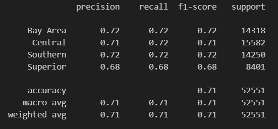
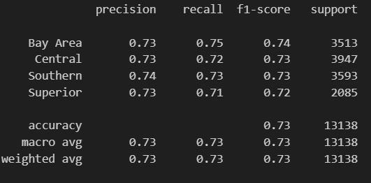
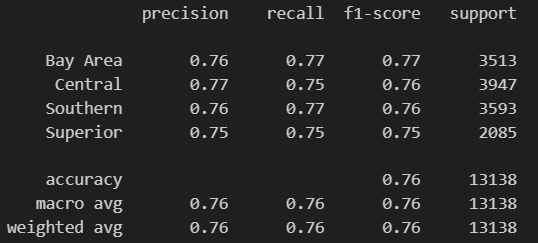
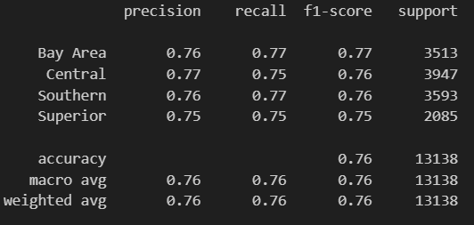

# 1. Introduction

This project aims to predict the California region (i.e. Superior Counties, Bay Area Counties, Central Counties, Southern Counties, Los Angeles Counties) in which an establishment is based using features such as number of establishments, establishment sector, average weekly wages, and average monthly employment present in the [Quarterly Census of Employment and Wages (QCEW) dataset](https://catalog.data.gov/dataset/quarterly-census-of-employment-and-wages-qcew-a6fea). We will employ machine learning algorithms and specialized models in order to accomplish this task. Our model will be a classification model doing supervised learning since California counties, which can be mapped to regions, are included in the QCEW dataset. This model could highlight which establishment sectors are popular in any given California region. We chose this project because inferring the region in which an establishment is based using features of that establishment seemed interesting and it helps us understand which establishments are popular and unpopular in any California region. Knowing where certain establishment sectors are popular or unpopular enables entrepreneurs to find untapped markets where there may be little competition or markets to stay away from with low chances for success.

# 2. Methods

## Data Exploration

Here are the steps we took to explore our data: 
- Print a heatmap for non-categorical data
- Print the columns of the dataset
- Print the mean, count, standard deviation, minimum, 25% quartile, 50% quartile, 75% quartile, and maximum for every column in the dataset
- Print the number of datapoints from years 2018 - 2019
- Print all unique values in the *industry names* column
- Print all null values in each column
- Print the datatypes of each column
- Perform shapiro wilks test on non-categorical data
- Print all unique values in the *Area Types* column
- Print the number of datapoints where *Area Type* is county
- Print a pairplot that only includes obeservations where *Area Type* is county, *Year* is either 2019 or 2018, and *Quarter* is annual
- Print a heatmap for non-categorical data

## Preprocessing

Here are the steps we took to [preprocess](https://github.com/ericstratford/predictable-residence/blob/Milestone2/CA_Residence_Prediction.ipynb) our data: 
- Drop the columns *Ownership*, *1st Month Emp*, *2nd Month Emp*, *3rd Month Emp*, and *Total Wages (All Workers)*
- Drop columns *Area Type* and *Quarter*
- Drop observations from 2016 and 2017
- Drop outliers using IQR
- Create the column *Sector* which is just a remapping of *NAICS*
- Replace columns *NAICS Level*, *NAICS Code*, and *Industry Name* with *Sector*
- Create the *log_weekly_wages* column which is just a log transformation of the *Average Weekly Wages* column
- Create the *log_monthly_employment* column which is just a log tranformation of the *Average Monthly Wages* column
- Create a dataframe that one hot encodes the *Sector* feature
- Create a dataframe that label encodes the *Sector* feature
- Create a dataframe that drops the *Sector* feature

## Model 1

Here are the steps we took to create our [first model](https://github.com/ericstratford/predictable-residence/blob/Milestone3/CA_Residence_Prediction.ipynb): 
- Split the data into train and test using the one hot encoded dataframe
- Train and test our data using a decision tree model with criterion set to gini, a max_depth of 50, and min_samples_split set to 2
- Train and test our data using a random forest model with n_estimators set to 100, a max_depth of 50, and min_samples_split set to 2
- Train and test our data using a k-nearest neighbors model with n_neighbors set to 5

## Model 2

Here are the steps we took to create our [second model](https://github.com/ericstratford/predictable-residence/blob/main/CA_Residence_Prediction.ipynb): 
- Map counties to their respective regions
- Standardize X_train and X_test using normalization
- Get the average k-fold cross validation accuracy for decision tree model with cv = 10 (decison tree model has parameters criterion='gini', max_depth=40, min_samples_split=2, and random_state=0)
- Train and test our data using a decision tree model with same parameters as before
- Get the average k-fold cross validation accuracy for k-nearest neighbors model with cv = 5 and scoring set to accuracy (k-nearest neighbors has parameters n_neighbors=2 and weights='distance')
- Train and test our data using a k nearest neighbors model BEFORE hyperparamter tuning with the same parameters as before
- Perform hyperparameter tuning for our k nearest neighbors model
- Train and test our data using a k nearest neighbors model AFTER hyperparameter tuning (k-nearest neighbors has parameters 'n_neighbors': 1, 'p': 2, 'weights': 'uniform')
- Calculate the accuracy, true positive rate, true negative rate, false positive rate, and false negative rate for each class with k-nearest neighbors

# 3. Results

## Data Exploration

Results from data exploration: 
- The columns of the dataset are *Area Type*, *Area Name*, *Year*, *Quarter*, *Ownership*, *NAICS Level*, *NAICS Code*, *Industry Name*, *Establishments*, *Average Monthly Employment*, *1st Month Emp*, *2nd Month Emp*, *3rd Month Emp*, *Total Wages (All Workers)*, and *Average Weekly Wages*.
- The mean, count, standard deviation, minimum, 25% quartile, 50% quartile, 75% quartile, and maximum for every column in the dataset are shown in **Figure 1**

<b>Figure 1.</b> Mean, count, standard deviation, minimum, 25% quartile, 50% quartile, 75% quartile, and maximum for each column

 

- The number of datapoints from 2018-2019 is 506913.
- There are too many industry names to list (1000+ unique industry names).
- There are no null values in the dataset.
- The datatypes of each column are shown in **Figure 2**

<b>Figure 2.</b> Columns and their associated datatypes

 

- Shapiro Wilks test failed because we have too many observations.
- The following are all the unique Area Types: 'County', 'California - Statewide', 'United States'
- 441540 datapoints are just counties.
- The pairplot that only includes obeservations where *Area Type* is county, *Year* is either 2019 or 2018, and *Quarter* is annual is shown in **Figure 3**

<b>Figure 3.</b> Pairplot that only includes observations where <i>Area Type</i> is county, <i>Year</i> is either 2019 or 2018, and <i>Quarter</i> is Annual

 

- The heatmap for non-categorical data is shown in **Figure 4**

<b>Figure 4.</b> Heatmap for non-categorical data

 

## Preprocessing

Results from preprocessing:

- The resulting dataframe after performing all of the preprocessing steps outlined in the methods section is shown in **Figure 5**

 
<b>Figure 5.</b> Resulting dataframe after performing preprocessing

 

## Model 1

Results from Model 1:
- Decision Tree Classification Model:
    - Training accuracy: 0.9995052425263078
    - Testing accuracy: 0.6148576647891613
- Random Forest Classification Model:
    - Training accuracy: 0.9995052425263078
    - Testing accuracy: 0.6089968031663876
- K-nearest Neighbors Classification Model:
    - Training accuracy: 0.4934254343399745
    - Testing accuracy: 0.1996498706043538

## Model 2

Results from Model 2:
- The resulting dataframe after mapping counties to their respective regions is shown in **Figure 6**

 
<b>Figure 6.</b> Resulting dataframe after mapping counties to their respective regions 

 

- For Decision Tree Classification Model
    - Cross-validation accuracy: 0.7119370078797174
    - Testing accuracy: 0.7318465519866038
    - The classification reports for the training and testing sets are shown in **Figure 7** and **Figure 8**, repsectively
   

 
<b>Figure 7.</b> Training set classification report for the decision tree classification model

 
    

 
<b>Figure 8.</b> Testing set classification report for the decision tree classification model

 

- For K-nearest neighbors classification Model
    - Mean accuracy: 0.720157491662262
    - Testing accuracy: 0.7636626579388035
    - Best Hyperparameters:
        - n_neighbors = 1
        - p = 2
        - weights = uniform
    - Best Cross-Validation Accuracy after hyperparameter tuning: 0.7201574934726983
    - Testing Accuracy after hyperparameter tuning: 0.7637
    - The classification reports for testing set before and after hyperparameter tuning can be seen in **Figure 9** and **Figure 10**, respectively

 
<b>Figure 9.</b> Testing set classification report for the k-nearest neighbors model before hyperparameter tuning 

 
    

 
<b>Figure 10.</b> Testing set classification report for the k-nearest neighbors model after hyperparameter tuning

 

- True positive, false positive, true negative, and false negative by class

|                   | Class 0  | Class 1 | Class 2 | Class 3 |
| :---------------- | :------: | :-----: | :-----: | :-----: |
| Class 0           |   2722   | 321     |  343    | 127     |
| Class 1           |   359    | 2977    | 371     | 240     |
| Class 2           |  358     | 325     |  2760   | 150     |
| Class 3           |  131     | 228     |  152    | 1574    |

# 4. Discussion

## Data Exploration

Prior to preprocessing and model implementation, extensive data exploration was done to understand the structure and characteristics of the QCEW dataset. This step was important for identifying potential issues such as missing values, data distributions, and relevant features for analysis. Key exploratory steps were:
- Heatmap Analysis: A heatmap was generated for non-categorical data to identify potential correlations between numerical variables.
- Descriptive Statistics: Summary statistics, including mean, standard deviation, quartiles, and maximum/minimum values, were calculated for all columns to assess central tendency and variability.
- Null Value Check: The dataset was checked for missing values in each column, enabling us to determine whether or not data cleaning would be required.
- Data Filtering: Specific subsets of data were analyzed, such as observations where Area Type was county and Year was 2018 or 2019, to ensure that there would be enough relevant data points to use.
- Normality Test: A Shapiro-Wilk test was performed on non-categorical data to normality.
- Pairplot Generation: Visualizations, such as pairplots, were generated to explore relationships between variables.

These exploratory steps provided insights into the dataset's structure, ensuring that the features selected for modeling were relevant and that potential data issues could be addressed when moving forward. For example, identifying the number of older data points helped us to focus on the more meaningful subsets of the data. Additionally, the use of pairplots and heatmaps allowed us to visualize relationships and refine feature selection.

## Preprocessing

During our preprocessing step, we dropped many of the columns from the original dataset. We felt like this would help with the accuracy and real-world applicability of our models. For starters, we dropped the data from 2016 and 2017 from our dataset since having dates from more recent years would better reflect current conditions. The dataset is quite large so splitting it in half would also reduce the overall computational cost. We also decided to only retain rows that contained annual data since we do not want quarterly and annual information for the same establishments mixed together as that may introduce noise. Another step we took was creating a new column called *Sector* which would use the NAICS code mapping to derive broader encompassing sectors to categorize each data point. This dramatically reduced the number of *Industries* we had, helping us keep dimensionality low when encoding. We also dropped any other columns that we did not believe would help with the predictive power of the model based on our data exploration to further reduce the dimensionality. One thing that we dropped during our preprocessing that may have been beneficial to keep however was *Ownership* since knowing if an establishment was owned federally or by a private party may have helped with the accuracy of our models. For example, the city of San Diego was established due to the Navy's large presence, so it makes sense that there are more federally owned establishments here. This is something we should have taken into consideration before making the decision to drop that column.

## Model 1

For our first model, we initialy tested three different models to get an understanding of what would work best with our data. We decided to go with a decision tree model because it was yielding the best test accuracy. The decision tree model was also appealing since our dataset has both numerical variables, such as income levels, and categorical variables, such as industry type. Decision trees can easily work with different data types without requiring extensive preprocessing, such as scaling or encoding. Furthermore, the simplicity of decision trees makes them computationally efficient, which was an advantage during the exploratory phase of our analysis. The use of the Gini impurity ensured that the model focused on maximizing similarities in each node, which is ideal for a classification task. However, decision trees are prone to overfitting, and this was an issue that we ran into. Unfortunately, our training accuracy was roughly 20-30% higher than our testing accuracy. We attempted to tune the model by pruning it, but dealt with sharp drops in model performance; we struggled with balancing the issue of overfiting and the accuracy of our model.

## Model 2

Building on our expereince from Model 1 we implemented a second decision tree model, but  this time we incorporated cross-validation to address the overfitting issue observed in the first model. Cross-validation helped evaluate the model's performance on multiple subsets of the dataset and enabled us to fine-tune hyperparameters, such as maximum depth and minimum samples per split, to achieve better performance. By using cross-validation, we were able to slightly increase the accuracy of the second model. We also fine-tuned our KNN model by reducing the number of neighbors and specifying that neighbors of closer distance bear greater influence on the predictions. Through this fine tuning we were able to drastically improve that other model's performance. However, the KNN model still did not perform as well as the Decision Tree model, so we went with the latter. Despite the improvement to the model, it's accuracy was still lower than we would like and the model is struggling to fully capture the underlying relationship in our data.

# 5. Conclusion

In conclusion, our model still is not where we would like it to be as it is underfitting a bit. However, it still performs reasonably well. If we had more time with this project we would definitely try other models to achieve a higher testing accuracy. If we could start our project over from the beginning with the knowledge we have now, we would definitely spend much more time considering the data and making the data much more usable before we started using various models. One issue we discovered is that while we had a lot of data, it wasn't enough to properly classify the various output classes in our data. We had to combine output classes in order to improve our results. Some models we could use in the future include SVMs and neural networks. 

# 6. Statement of Collaboration

Name: Eric Stratford\
Title: Team Leader\
Contribution: Created the group repository and discord. Assisted with pre-processing, tuning models, reviewing code, and writing all milestone write ups.

Name: Kesler Anderson\
Title: Project Manager\
Contribution: Managed project deadlines by making Gradescope submissions and creating milestone branches. Assisted with reviewing code and writing all miletone write ups.

Name: Syed Usmani\
Title: Coder/Writer\
Contribution: Assisted in pre-processing, tuning models, adding cross-validation, and writing all milestone write ups.

Name: Maasilan Kumaraguru\
Title: Coder/Writer\
Contribution: Assisted with pre-processing by removing outliers using IQR. Worked on improving testing and training accuracy on the k-nearest neighbors model. Contributed to writing all milestone write ups.

Name: Viet Tran\
Title: Coder/Writer\
Contribution: Assited with coding and writing.
