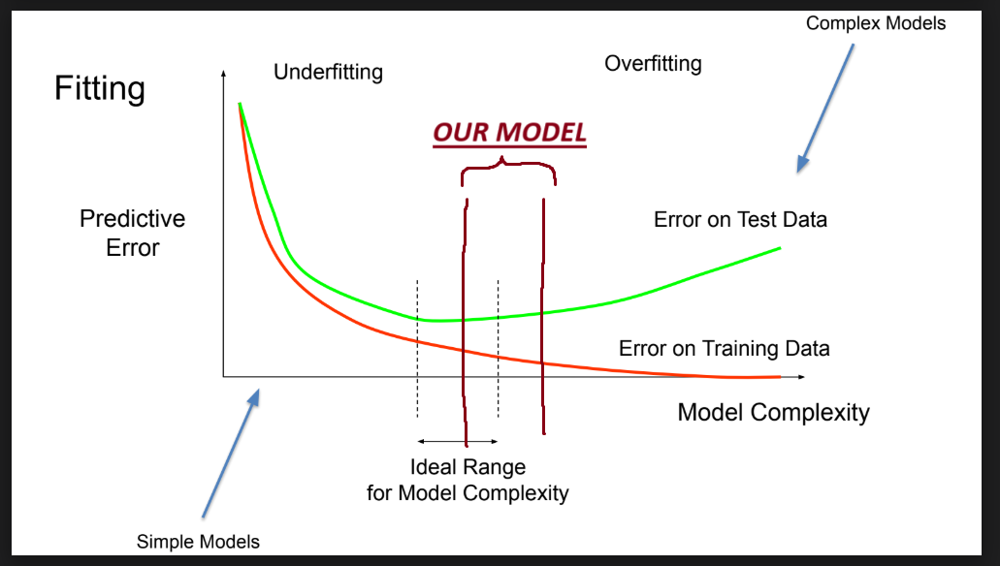

# predictable-residence
This project (tentatively) aims to predict the residence of Californians based on demographic and characteristic features.

# Milestone 2: Pre-processing Plans

## Pre-processing Plans:
### How will you preprocess your data?
Based on the inital data exploration we've done, we plan to drop all rows that are from 2016 and 2017, keeping only those from 2018 and 2019. We are doing this because the dataset is quite large, and since we are dealing with economic data, we want to use the most recent information. We also plan to use the NAICS Code column to create a new column with the economic sector, something that is built into the NAICS code structure. This is because we have 1586 unique industry names, and many of them are very specific, so we want to bring this number down by mapping the rows to broader encompassing sectors. This will make the encoding much easier, which is something that we'll need to do since the columns are categorical variables with no intrinsic ordering. Due to the nature of the columns, we believe that binary encoding would be the best to use. We also plan to drop '1st Month Emp', '2nd Month Emp', '3rd Month Emp', and 'Total Wages (All Workers)' since we already have Average Monthly Employment capturing similar data and we also don't need to know the total wages since we are more concerned with individuals. We also want to remove rows whose 'Quarter' column is not "Annual" because keeping Quarterly data means that there may be overlap between whats captured in the "Annual" rows and the quarterly information. We also want to filter out rows whose 'Area Type' column is anything but "County" since that is what we are trying to predict. After removing those rows, we can remove the columns 'Area Type' and 'Quarter'. There are no null values to drop or replace in any of the columns; however, the standard deviation of many of the columns is quite high, so we will have to remove many outliers. Perhaps we could remove outliers using IQR. We can't use the shapiro wilks test because we have too much data, so we will have to use another method to determine whether our numerical data is normally distributed or we will have to rely on MinMaxStandardization.

## Notebook Link:
[Milestone 2 Notebook](https://github.com/ericstratford/predictable-residence/blob/Milestone2/CA_Residence_Prediction.ipynb)

# Milestone 3: Pre-Processing

## Updates:
We began major preprocessing by dropping data that we thought was irrelevant or redundant. We dropped data from 2016 and 2017 because we felt it was too outdated and would not help our model make accurate predictions. We also dropped the total wages, individual months of employement, and quarter because there was overlap between these columns and other that we kept. Lastly, we dropped area type and business ownership because we felt that these were irrelevant for our purposes.

Next, we dropped outliers using IQR and used NAICS code to generalize industry names into broader categories. Once this was finished, we tried out both one-hot encoding and label encoding for the 'Sector' feature. For both encodings, we trained decision tree models with different depths (30 and 50) and splits (5 and 2) and compared the test accuracy results. We found that the highest test accuracy came from using one-hot encoding with a decision tree with a depth of 50 and split of 2.

In preparation for the next milestone, we also trained a random forest model with the same two encodings and found that the highest test accuracy came from using label encoding with a depth of 50 and a split of 3.

## Model Evaluation:
### Where does your model fit in the fitting graph?

The model has much higher error on test data than it does on training data.
### What are the next models you are thinking of and why?
The next models we are thinking about using are Naïve Bayes, a support vector machine, k-nearest neighbors, or random forest. Specifically, we are thinking about using Naïve Bayes because if our data is conditionally independent, Naïve Bayes should work well. This is significant because it does seem like our data should be conditionally independent by cursory glance. Additionally, Naïve Bayes supports label encoding, whereas models like SVM don't support label encoding. This is significant because using label encoding could help us avoid the curse of dimensionality that could arise from one-hot and binary encoding. However, using an SVM with a soft margin would help us avoid overfitting to the training data which is occuring now with our decision tree model.

## Conclusions:
### What is the conclusion of your 1st model? 
The conclusion of our first model is a very high training accuracy of ~0.9995 and an abysmal testing accuracy of ~0.6149. In other words, our decision tree model overfits to the training data and doesn't generalize well.
### What can be done to possibly improve it?
To improve our first model we could make use of k-fold cross validation.

## Notebook Link:
[Milestone 3 Notebook](https://github.com/ericstratford/predictable-residence/blob/Milestone3/CA_Residence_Prediction.ipynb)

# Milestone 4:

## Updates:
**TODO: Add updates here**

## Model Evaluation:
### Where does your model fit in the fitting graph?

The model has a lower accuracy for test data than for training data. There is roughly a 25% difference between the two.
### What are the next models you are thinking of and why?
The next models we are thinking about using SVM since it works well as a classifier for non-linear decision boundaries, and we can pair this with PCA to reduce the dimensionality of the dataset. Another option we are considering is a neural network using a multilayer perceptron model, which may work well since the dataset is large and complex. All of our models so far have had low accuracy, indicating that the relationship between the features and the target may be difficult to capture, an MLP model may be able to capture the relationship given the size of the dataset.

## Conclusions:
In conclusion, after grouping counties into broader regional categories and using cross-fold validation to evaluate our model fitting, overfitting is no longer a problem but accuracy remains less than ideal, at around 70-75% for all models trained.
### What is the conclusion of your 2nd model? 
The conclusion of our second model is that it is not a more precise model than our first one. Improvements in accuracy came from additional data preprocessing and were not due to the use of KNN. 
### What can be done to possibly improve it?
We could apply PCA to our test and train sets prior to fitting the model.

## Notebook Link:
[Milestone 4 Notebook](https://github.com/ericstratford/predictable-residence/blob/Milestone4/CA_Residence_Prediction.ipynb)

# Introduction to Your Project
Our project aims to predict the California region (i.e. Superior Counties, Bay Area Counties, Central Counties, Southern Counties, Los Angeles Counties) in which an establishment is based from observations of establisments based on features like number of establishments, establishment sector, average weekly wages, and average monthly employment using the Quarterly Census of Employment and Wages dataset (linked [here](https://catalog.data.gov/dataset/quarterly-census-of-employment-and-wages-qcew-a6fea)). We will employ machine learning algorithms and specialized models in order to accomplish this task. Our model would be a classification model doing supervised learning since California counties, which can be mapped to regions, are included in the dataset. This model could highlight which establishment sectors are popular in any given California region. We chose this project because inferring the region in which an establishment is based from features of that establishment seemed interesting. Inferring the region in which an establishment is based from features of said establishment is significant because it helps us understand which establishments are popular and infer which are unpopular in any California region. Knowing where certain establishmnt sectors are popular or unpopular enables entrepreneurs to find untapped markets where there may be little competition.

# Figures

# Methods Section
## Data Exploration
In order to perform data exploration we did the following: 
- printed a heatmap for non-categorical data
- printed the columns of the dataset
- printed the mean, count, standard deviation, minimum, 25% quartile, 50% quartile, 75% quartile, and maximum for every column in the dataset
- printed the number of datapoints from years 2018 - 2019
- printed all unique values in the *industry names* column
- printed all null values in each column
- printed datatypes of columns
- performed shapiro wilks test on non-categorical data
- printed all unique values in the *Area Types* column
- printed the number of datapoints where *Area Type* is county
- printed a pairplot that only includes obeservations where *Area Type* is county, *Year* is either 2019 or 2018, and *Quarter* is annual
## Preprocessing
In order to perform preprocessing we did the following: 
- Drop columns Ownership, 1st Month Emp, 2nd Month Emp, 3rd Month Emp, and Total Wages (All Workers)
- Dropped columns *Area Type* and *Quarter*
- Dropped observations from 2016 and 2017
- Dropped outliers using IQR
- Created the column *Sector* which is just a remapping of *NAICS*
- Replaced columns *NAICS Level*, *NAICS Code*, and *Industry Name* with *Sector*
- Created the *log_weekly_wages* column which is just a log transformation of the *Average Weekly Wages* column
- Create the *log_monthly_employment* column which is just a log tranformation of the *Average Monthly Wages* column
- Create a dataframe that one hot encodes the *Sector* feature
- Create a dataframe that label encodes the *Sector* feature
- Create a dataframe that drops the *Sector* feature
## Model 1
In order to create Model 1 we did the following: 
- Split the data into train and test using the one hot encoded dataframe
- Trained and tested our data using a decision tree model
- Trained and tested our data using a random forest model
- Trained and tested our data using a k nearest neighbors model
## Model 2
In order to create Model 2 we did the following: 
- mapped counties to their respective regions
- Standardized X_train and X_test using normalization
- Got average k-fold cross validation accuracy for decision tree model with k = 10
- Trained and tested our data using a decision tree model 
- Got average k-fold cross validation accuracy for k nearest neighbors model with k = 10
- Trained and tested our data using a k nearest neighbors model
- Calculated the accuracy, true positive rate, true negative rate, false positive rate, and false negative rate across all classes for k nearest neighbors
# Results Section
## Data Exploration
Results from Data Exploration: 
- The columns of the dataset are *Area Type*, *Area Name*, *Year*, *Quarter*, *Ownership*, *NAICS Level*, *NAICS Code*, *Industry Name*, *Establishments*, *Average Monthly Employment*, *1st Month Emp*, *2nd Month Emp*, *3rd Month Emp*, *Total Wages (All Workers)*, and *Average Weekly Wages*.
- 
Fig 1. The mean, count, standard deviation, minimum, 25% quartile, 50% quartile, 75% quartile, and maximum for each column in our dataset
- The number of datapoints from 2018-2019 is 506913.
- There are too many industry names to list (1000+ unique industry names).
- There are no null values in the dataset.
- 
Fig 2. Columns and their associated datatypes
- Shapiro Wilks test failed because we have too many observations.
- The following are all the unique Area Types: 'County', 'California - Statewide', 'United States'
- 441540 datapoints are just counties.
- 
Fig 3. A pairplot that only includes observations where *Area Type* is county, *Year* is either 2019 or 2018, and *Quarter* is Annual.

Fig 4. A heatmap for non-categorical data
## Preprocessing
Results from Preprocessing: 

Fig 5. Resulting dataframe after performing all the preprocessing outlined in the methods section
## Model 1
Results from Model 1:
- Decision Tree Classification Model using Gini
    - Training accuracy: 0.9995052425263078
    - Testing accuracy: 0.6148576647891613
- Random Forest Classification Model
    - Training accuracy: 0.9995052425263078
    - Testing accuracy: 0.6089968031663876
- K nearest neighbors Classification Model
    - Training accuracy: 0.4934254343399745
    - Testing accuracy: 0.1996498706043538
## Model 2

Fig 6. Resulting dataframe after mapping counties to their respective regions
Results from Model 2:
- For Decision Tree Classification Model
    - Cross-validation accuracy: 0.7119750017016482
    - Testing accuracy: 0.7351195006850357
- For K nearest neighbors classification Model
    - Mean accuracy: 0.7141
    - Testing accuracy: 0.7598569036383012
- Combined rates across all classes:
    - Accuracy/Correct Rate: 0.7598569036383012
    - True Positive Rate: 0.7598569036383012
    - True Negative Rate: 0.919952301212767
    - False Positive Rate: 0.08004769878723296
    - False Negative Rate: 0.2401430963616989
# Discussion Section
## Data Exploration
Prior to preprocessing and model implementation, extensive data exploration was done to understand the structure and characteristics of the QCEW dataset. This step was important for identifying potential issues such as missing values, data distributions, and relevant features for analysis. Key exploratory steps were:
- Heatmap Analysis: A heatmap was generated for non-categorical data to identify potential correlations between numerical variables.
- Descriptive Statistics: Summary statistics, including mean, standard deviation, quartiles, and maximum/minimum values, were calculated for all columns to assess central tendency and variability.
- Null Value Check: The dataset was checked for missing values in each column, enabling us to determine whether or not data cleaning would be required.
- Data Filtering: Specific subsets of data were analyzed, such as observations where Area Type was county and Year was 2018 or 2019, to ensure that there would be enough relevant data points to use.
- Normality Test: A Shapiro-Wilk test was performed on non-categorical data to normality.
- Pairplot Generation: Visualizations, such as pairplots, were generated to explore relationships between variables.

These exploratory steps provided insights into the dataset's structure, ensuring that the features selected for modeling were relevant and that potential data issues could be addressed when moving forward. For example, identifying the number of older data points helped us to focus on the more meaningful subsets of the data. Additionally, the use of pairplots and heatmaps allowed us to visualize relationships and refine feature selection.
## Preprocessing
During our preprocessing step, we dropped many of the columns from the original dataset. We felt like this would help with the accuracy and real-worl applicability of our models. For one, we dropped the data from 2016 and 2017 from our dataset since having dates from more recent years would better reflect current conditions, also the dataset was quite large so halving it would also reduce the overall computational cost. We also decided to only retain rows that contained "Annual" data as opposed to quarterly, since we don't want quarterly and annual information for the same establishments mixed together, as this may introduce noise. Another step we took was creating a new column called "Sector" which would use the NAICS code mapping to derive broader encompassing sectors to categorize each data point. This dramatically reduced the number of "Industries" we had, helping us keep dimensionality low when encoding. We also dropped any other columns that we did not believe would help with the predictive power of the model based on our data exploration to further reduce the dimensionality. One thing that we dropped during our preprocessing that may have been beneficial to keep however was "Ownership", knowing if the establishment was owned federally or by a private party may have helped with the accuracy of our models, as San Diego for example was built up as a major city due to the Navy's large presence, and so it would make sense if there were more federally owned establishments here. This is something we should have explored before making a decision on dropping that column.  
## Model 1
For our first model, we tested three different models initially to get an understanding of what would work best with our data. We decided to go with the decision tree though because it was yielding better test accuracy. The decision tree model was also appealing given the nature of our datase since it both numerical variables, such as income levels, and categorical variables, such as industry type. Decision trees can easily work with different data types without requiring extensive preprocessing, such as scaling or encoding. Furthermore, the simplicity of decision trees makes them computationally efficient, which was an advantage during the exploratory phases of our analysis. The use of the Gini impurity criterion ensured that the model focused on maximizing similarities in each node, which is ideal for a classification task. Decision trees are however, prone to overfitting, and this was an issue that we ran into, as our training accuracy was roughly 20-30% higher than our test. We attempted to tune the model by pruning it but dealth with sharp drops in model performance, in general we struggled with balancing the issue of overfiting and accuracy. 
## Model 2
Building on the findings from Model 1, we implemented a second decision tree model but incorporated cross-validation to address the overfitting issue observed in the initial model. Cross-validation helped evaluate the model's performance on multiple subsets of the dataset, enabling us to fine-tune hyperparameters, such as maximum depth and minimum samples per split, to achieve better performance. Doing this we were able to slightly increase the accuracy of the model. We also fine-tuned our KNN model by reducing the number of neighbors and specifying in the parameters that neighbors of closer distance bear greater influence on the predictions. Doing this we were able to drastically improve that model's performance. KNN still did not perform as well as the Decision Tree classifier however, which is why we went with the latter.
# Conclusion
## Model 1
## Model 2

# Statement of Collaboration
Name:
(Job) Title:
Contribution:

Name: Syed
Title: Team Member
Contribution: Assited in pre-processing, tuning models, adding cross-validation, and writing.

Name:
Title:
Contribution:

Name:
Title:
Contribution:

Name:
Title:
Contribution:
